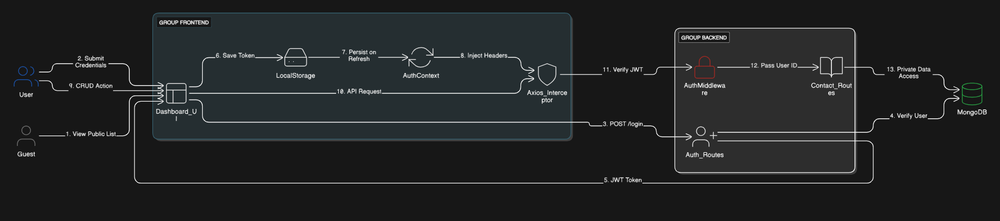

# ConnectHub - Full-Stack Contact Manager

ConnectHub is a professional MERN stack application designed for seamless contact management. It features a "Guest-First" architecture, allowing users to explore the dashboard before committing to an account.

---

## Live Links

- **Frontend:** [https://contact-manager-vert-two.vercel.app/](https://contact-manager-vert-two.vercel.app/)
- **Backend API:** [https://connecthub-backend-g8pu.onrender.com/](https://connecthub-backend-g8pu.onrender.com/)

### ⚠️ Note on Cold Starts
The backend for this project is hosted on Render's Free Tier.

-  The First Request: If the site hasn't been visited recently, the server will be in "hibernation." The first login or sign-up attempt may take 40–60 seconds to wake up.

- The 404/Delay: You may see a temporary 404 or a long loading state in the console during this "Cold Start" period.

- Performance: Once the server is awake, the application will respond instantly.

---

## Data Flow Diagram

This project follows a decoupled MERN architecture with JWT-based authentication. The diagram below illustrates how user requests are authenticated and how data flows through the system.



---

### Authentication & Data Cycle:

1. **User Auth:** User signs in -> Backend issues **JWT** -> Frontend stores token in **LocalStorage**.
2. **Request Interceptor:** **Axios Interceptor** injects the token into every request header (`x-auth-token`).
3. **Guard Middleware:** Backend `authMiddleware` validates the token before allowing CRUD actions.
4. **Data Isolation:** Contacts are queried using the `req.user.id` to ensure users only see their own data.

---

## Features

- **Guest-First Dashboard:** Publicly accessible dashboard with a Call-to-Action for guests.
- **JWT-based Authentication:** Secure User Registration and Login using JWT (JSON Web Tokens) and Bcrypt.js.
- **Persistent Sessions:** Custom `/api/auth/me` endpoint ensures users stay logged in on page refresh.
- **Private CRUD Operations:** Users can only view, add, and delete their own private contacts.
- **Responsive Design:** Built with React and Tailwind CSS for a modern, mobile-friendly experience.
- **Robust Error Handling:** Professional backend validation and duplicate key prevention.

---

## Tech Stack

- **Frontend:** React, Vite, Tailwind CSS, Lucide Icons, Axios.
- **Backend:** Node.js, Express.js.
- **Database:** MongoDB (Mongoose ODM).
- **Security:** JWT for authorization, Bcrypt for password hashing.

---

## Project Structure

```text
├── backend/
│   ├── controllers/   # Logic for Auth and Contacts
│   ├── models/        # Mongoose Schemas (User, Contact)
│   ├── routes/        # API Endpoints
│   └── middleware/    # JWT Authentication Guard
├── frontend/
│   ├── src/
│   │   ├── api/       # Axios configuration & interceptors
│   │   ├── context/   # AuthState management
│   │   └── components/# UI Components (ContactForm, List, GuestCTA)
```

---

## Installation & Setup

1. Clone the repository:

```bash
git clone https://github.com/Koushiki-Chakraborty/contact-manager.git
cd contact-manager
```

2. Setup Backend:

- Open a terminal and move to the backend folder:
    ```bash
    cd backend  
    ```

- Install dependencies: 
    ```bash
    npm install 
    ```

- Create a `.env` file in the `/backend` directory based on the variables below:
  (A `.env.example` file is included to document required keys)

  ```text

  MONGO_URI=your_mongodb_connection_string
  JWT_SECRET=your_secret_key
  PORT=5000
  ```

- Start the server: npm run dev.

3. Setup Frontend:

- Open a second terminal and move to the frontend folder:
    ```bash
    cd frontend
    ```
- Install dependencies: 
    ```bash
    npm install
    ```

- Create a .env file in the /frontend directory:

  ```text
  VITE_API_URL=http://localhost:5000/api
  ```
(Note: Use the localhost URL for local testing)

- Start the app: npm run dev.

---

## API Endpoints

### Authentication

| Method | Endpoint           | Description       |
| ------ | ------------------ | ----------------- |
| POST   | /api/auth/register | Register new user |
| POST   | /api/auth/login    | Login user        |

### Contacts (Protected)

| Method | Endpoint          | Description        |
| ------ | ----------------- | ------------------ |
| GET    | /api/contacts     | Get user contacts  |
| POST   | /api/contacts     | Create new contact |
| DELETE | /api/contacts/:id | Delete contact     |
